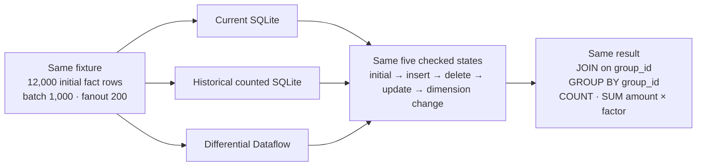
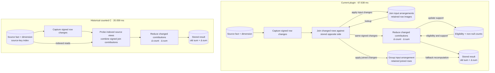

# COUNT/SUM recovery, 2026-09-21

The recovered performance target remains unmet. Same-machine medians for
12,000 initial rows, batch 1,000, fanout 200, three repetitions:

## Same inputs and answer



Each engine receives its own copy of the fixture. Both source-row hashes and
result hashes agree. The timings below total the four mutations and materialized
result reads, excluding initial population and oracle checks.

| Arm | Mutation + result materialization | Current / arm |
|---|---:|---:|
| Current sqlite_ivm plugin | 67.638 ms | 1.00× |
| Rebuilt historical counted C, sprefa e2052d5ae | 20.059 ms | 3.37× |
| Volatile DD | 1.000 ms | 67.64× |

## Where the current plugin does additional storage work

Rectangles are operations; cylinders are persistent SQLite tables. This is a
schematic of the benchmark query. It omits scratch tables and bookkeeping.
Arrows show data dependencies, not a measured allocation of the elapsed time.



The current integer SUM path avoids recomputing whole affected groups, while
still updating their retained input rows. Those rows support the general
fallback path. The historical source-view arm avoids the duplicate join/group
row images shown above. DD maintains its indexes and aggregates in memory;
the two SQLite arms commit source and maintained state through WAL/FULL.

The measured gap is **47.579 ms**. Its split between duplicate storage, trigger
checks, expression evaluation, cache settings, and other work has not been
isolated. The graph identifies work to investigate; it does not assign that
entire gap to the highlighted storage difference.

## What incremental SUM changed

Illustrative group, independent of the benchmark fixture: two fact rows with
amount 5, dimension factor 3. One amount changes from 5 to 7.

```text
                         BEFORE                 CHANGE                 AFTER

Source amounts           [5] [5]               [5] → [7]              [7] [5]
Joined contributions    [15] [15]            retract 15, add 21       [21] [15]
                                                 │
                                                 ▼
                                            Δ sum = +6
                                            Δ count = 0
                                                 │
Stored aggregate         sum = 30 ────────────────┴──────────────────► sum = 36
                         count = 2 ─────────────────────────────────► count = 2

Current storage work     source rows → join input rows → group input rows
                         These writes remain even when SUM uses only the delta.
```

An unsafe integer range or other value domain follows the fallback branch:

```text
changed group ──► eligibility check ──┬─ safe ──► stored sum + signed contribution
                                    │
                                    └─ fallback ──► read retained group members
                                                    │
                                                    └─► recompute group result
```

All nine cases, three arms, three repetitions matched the five-state input and
output hashes. The quick circuit run produced 240 checksum-valid case-total
records across 20 circuits and three engines, including warmups, with no errors.
The root suite has 73 passing tests. Native loading has three passing tests;
CRUD and CLI checks pass. Existing growth classes and timing tolerances remain
unchanged. Exact SQL-cost pins were refreshed for the changed statements.

```bash
cd /Users/chrishafley/projects/sqlite_ivm && just crossover-observe
cd /Users/chrishafley/projects/sqlite_ivm && just verify
cd /Users/chrishafley/projects/sqlite_ivm && just shootout quick
```

## Implemented

- Arrangement UPSERT uses a unique index on hash plus exact row identity.
  Legacy hash-only indexes keep the previous exact-match path. Collision and
  format-5 reopen tests exercise both paths.
- A join feeding a group through plain column projections lets the group
  consolidate its signed input, removing the intermediate consolidation.
- Terminal groups with projected keys read affected stored before-images
  through an index. The existing damaged-result repair check remains covered.
- Terminal integer-key COUNT(*)/SUM groups maintain nullable support counts and
  eligibility in transactional shadow state. Signed small-integer contributions
  update stored sums; other value domains retain affected-group recomputation.
  Eligibility is conservative and stays invalid after a group leaves the domain.
- Format 6 prevents older binaries from silently leaving the new support state
  stale. Format 5 continues on its existing layout.

Tests cover nullable sums, multiple sums, last non-null deletion, empty globals,
large integers, REAL fallback, failed writes, savepoints, WAL snapshots, rename,
reopen, drop, hash collisions, and defensive shadow protection. A hafley-observe
growth assertion holds changed rows constant while growing the group 16×; the
COUNT/SUM drain remains in the constant VM-work class.

## Measurements and boundaries

Earlier paired starting measurements were 92.807 ms current / 25.150 ms
historical. Intermediate current medians were 82.095 ms after identity UPSERT,
74.331 ms after stored group before-images and join consolidation removal,
80.359 ms for a prototype that rescanned group members to establish eligibility,
and 67.158 ms after transactional eligibility/support counts. These separate
runs are retained under `bench/results/recovery-crossover-*`; host timing varies.

The final three-arm run is `bench/results/count-sum-observe/`. Its `timings/`
directory holds uninstrumented receipts. `current/` and `historical/` hold four
per-mutation Chrome traces, SQLite event stores, and profile.json. The compact
committed [receipt](4_count_sum_recovery.json) retains samples, hashes, and
diagnostic attribution. Full captures remain local because they include large
trace files and databases.

hafley-observe provides CountRecorder, event_stats, FieldStats, Chrome export,
dictionary-encoded SQLite event storage, and process sampling. SQL workloads,
oracles, phase attribution, and performance interpretations remain in sqlite_ivm.
Capture overhead is included only in diagnostic wall times. Nested SQLite
profile times overlap; raw counters accumulate on statement handles. Their sums
are not total execution work. Unavailable EXPLAIN plans retain their error.

Both SQLite timing arms use WAL/FULL. The historical arm uses indexed source
views and an 8 MiB page cache. The current arm uses persistent join/group
arrangements and default cache settings. Initial population differs and is
outside the mutation timer. DD is volatile.

The captured final database occupies 2,064,384 bytes for current SQLite and
1,159,168 bytes for the historical arm. Current traces show writes to both join
and group input arrangements. The historical source-view arm avoids those
duplicated row images. Removing that work while preserving general join and
aggregate fallback semantics remains outstanding.
